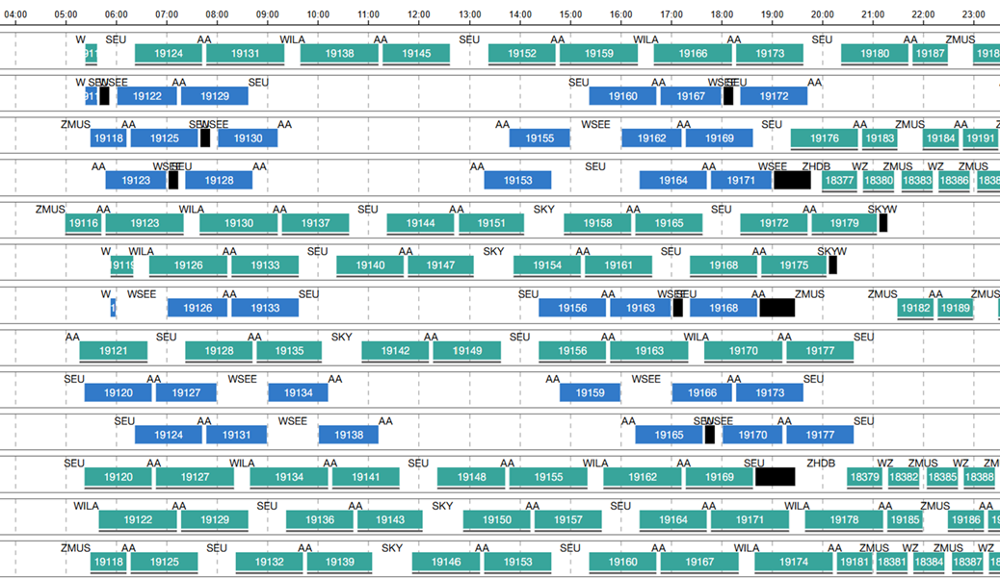
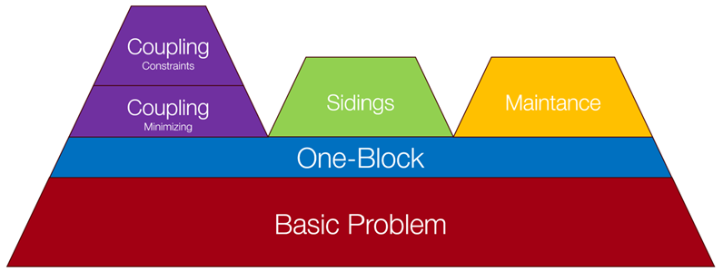
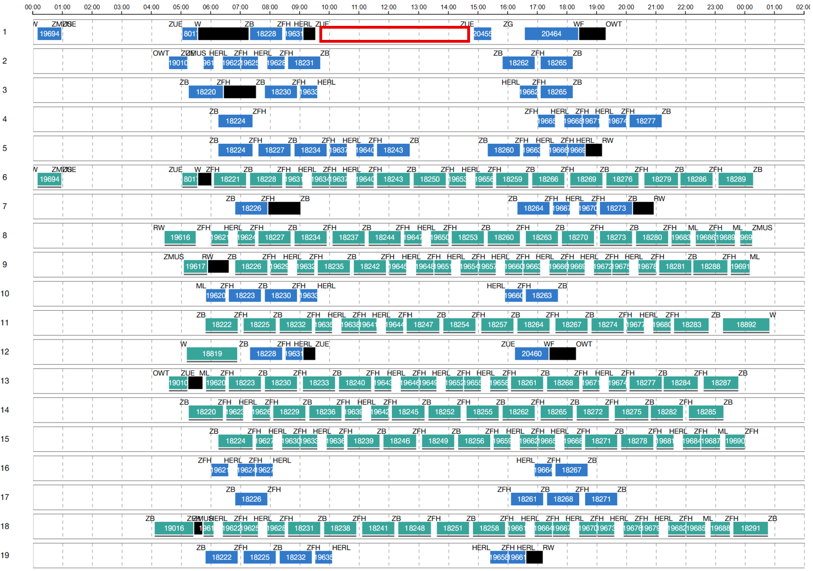
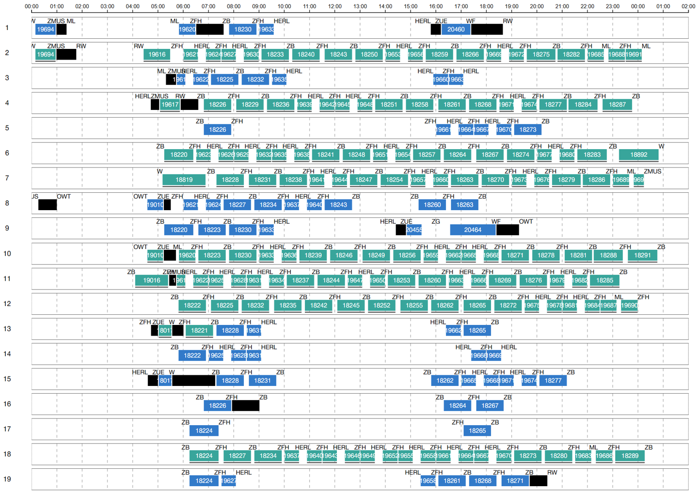
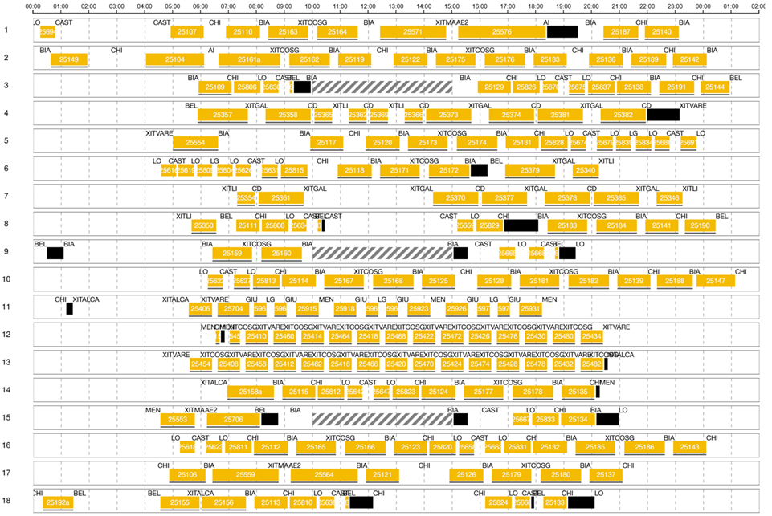

# Rotaziun

Rotaziun, provided by SBB (Swiss Federal Railways), is a linear program designed to solve the strategic vehicle rostering problem (German: Strategische Rollmaterialeinsatzplanung).

Given a set of commercial trips, Rotaziun computes the optimal chaining of these trips into rotations (German: Umläufe). It focuses on minimizing both the number of vehicles required to serve all commercial trips and the number of empty trips. Additionally, Rotaziun seamlessly integrates various constraints related to sidings, maintenance windows, coupling, and other operational issues. The solver operates quickly and provides a high level of interaction between the solver and the planner, making the optimization process efficient and user-friendly.

#### Table Of Contents

- [Introduction](#introduction)
    - [Overview](#overview)
    - [Input/Output](#input-output)
- [Modules](#modules)
    - [Basic Problem](#basic-problem)
    - [One-Block](#one-block)
    - [Coupling Decoupling](#coupling-decoupling)
    - [Sidings](#sidings)
    - [Maintenance](#maintenance)
- [Input](#input)
    - [Internal Parameters](#internal-parameters)
    - [Default Values](#default-values)
- [Output](#output)
  - [Section Chains](#section-chains)
  - [Solution Status](#solution-status)
  - [Metrics](#metrics)
- [Tipps](#tipps)
- [Getting Started](#Getting-Started)
- [Contributing](#Contributing)
- [Documentation](#Documentation)
- [Code of Conduct](#code-of-conduct)
- [Coding Standards](#coding-standards)
- [License](#License)

## Introduction

### Overview

The goal of strategic vehicle rostering is to efficiently create feasible rotations within the public transport planning process. These rotations are essential for estimating various metrics, such as the number of vehicles required, the kilometers driven by empty trips, and the siding capacity at each station. The focus is on the demand perspective and the dimensioning of a line's capacity.

Due to the broader perspective of the problem, certain simplifications are made compared to productive vehicle rostering. For instance, only one weekday is considered, maintenance is not fully addressed, and not all operational constraints are included. This level of detail is not yet required in this phase of the public transport planning process.

#### Advantages
- **Interaction Planner-Solver:** Enables seamless iterative collaboration between the planner and the solver.
- **Integration of Constraints:** Easily integrates various operational constraints.
- **Fast Computation:** Optimized to deliver quick results.

#### Functionality

Rotaziun can handle advanced operational constraints related to sidings, maintenance, and coupling.

### Input-Output

#### Input (I/O)

- **Commercial Sections:** A list of commercial trips.
- **Maintenance Windows:** A list of maintenance windows.

**Class:** *ch/sbb/simba/backend/mikado/solver/models/RotaziunSection.java*

#### Output (I/O)

- **Rotations/ Blocks:** A list of vehicle rotations/ rosters (German: Umläufe).

#### Commercial Section

- **Departure & Arrival Time**
- **Departure & Arrival Station**
- **Vehicle Type**
- **Core/ Enforcement (German: Stamm/ Verstärker)**

#### Maintenance Window

- **Time Window**
- **Location**

#### Rotations/ Blocks

A rotation, also known as a block, is a closed chain of commercial sections and maintenance windows. The first section of a block begins at the station where the last section of the block ends. If necessary, a block may include empty trips between chained commercial sections or maintenance windows to create a closed, feasible section chain.

A block is divided into block days (German: Umlauftag). Additionally, a block day consists of block items (German: Umlaufelemente). A block item can be a commercial section, a maintenance window, or an empty trip.

**Class:** *ch/sbb/simba/backend/mikado/solver/blocking/models/RotaziunBlock.java*

## Modules

The solver is designed in a modular fashion. Depending on the required constraints, specific modules of the solver can be activated as needed.

### Basic Problem

#### Optimization Criteria

- **vehicle cost per day:** Cost per block day [$/d]
- **empty trip costs** Cost per empty trip per km [$/km]
- **cost per stamm change:** Cost incurred when a vehicle changes its service type from Core (Stamm) to Reinforcement (Enforcement) [$/change]
- **cost per siding:** Cost for placing a vehicle in a siding between two chained sections [$/siding]
- **cost per debicode change:** Cost for changing debicode between two chained sections [$/change]

#### Constraints

- **min turn time:** Minimum time required between two chained sections [s]
- **required section chains:** Set of section pairs that must be chained directly together.
- **prohibited section chains:** Set of section pairs that must not be chained together.
- **prohibited empty trips:** Set of empty trips that are not allowed.
- **prohibited siding sites:** Stations where no siding is allowed.
- **min siding duration:** Time after which a standstill is considered a siding [s]

Example for the usage of constraints:

Initial solution of the solver:

Solution with siding constraint in ZUE (Zürich):

#### One-Block

- **only One-Block:** Enforces the use of only one block.

### Coupling-Decoupling

#### Objective

- **cost per coupling/decoupling:** Cost for one coupling or decoupling of two vehicles [$/coupling]

#### Constraints

- **min time for decoupling:** Minimum time required for Enforcement after decoupling from Core to continue with the next service [s]
- **min time for coupling:** Minimum time required for Enforcement, after ending its previous service, to couple to its Core [s]
- **prohibited coupling/decoupling stations:** Set of stations where coupling or decoupling is not allowed.

### Sidings

- **siding evaluation time:** Evaluation time at which siding capacity restrictions are checked [s]
- **siding capacity map:** Map specifying the maximum available siding length (in meters) for each station.

### Maintenance

This module ensures that maintenance items are distributed evenly across the entire block.
- **maintenance window distribution tolerance:** A value in the range [0, 1] — where 0 means a perfectly even distribution and 1 allows for any placement.

## Input

The input for Rotaziun consists of a list of commercial sections and maintenance windows, with the option for the maintenance window list to be empty. Additionally, an input parameter file (RotaziunInputParams) is required. This file contains all the operational constraints explained above, as well as some internal parameters for the solver.

**Class:** *ch/sbb/simba/backend/mikado/solver/parameters/RotaziunInputParams.java*

### Internal-Parameters

- **precisionLevel:** Determines the trade-off between computation speed and solution quality → 0: fast solve, 1: high solution quality, 2: very high solution quality.
- **numOfWorkers:** CP-SAT optimizer can use parallel computing; numOfWorkers defines how many solver instances are used. Depends on how many thready your server allowes.

### Default-Values

If one of the input parameters is not set by the user, then the solver will automatically choose the default value for this parameter.
The solver works, even in none of the input parameters is set by the user. Then, all input parameters are set to their default value.
All sets and maps are set by default to be empty.

| Parameter                              | Value    |
|----------------------------------------|----------|
| precisionLevel                         | 0        |
| numOfWorkers                           | 8        |
| minTurnTime                            | 180      |
| vehicleCostPerDay                      | 100*3600 |
| costPerStammChange                     | 10*60    |
| costPerSiding                          | 60       |
| costPerDebicodeChange                  | 60       |
| onlyOneBlock                           | true     |
| costForCouplingDecoupling              | 0        |
| minTimeForDecoupling                   | 0        |
| minTimeForCoupling                     | 0        |
| minSidingDuration                      | 2*3600   |
| sidingEvaluationTime                   | 3*3600   |
| maintenanceWindowDistributionTolerance | 0.3      |

**Class:** *ch/sbb/simba/backend/mikado/solver/parameters/InputDefaultValues.java*

## Output

The output is stored in a result file (RotaziunResultParams).

**Class:** *ch/sbb/simba/backend/mikado/solver/parameters/RotaziunResultParams.java*

### Section Chains

- **blocks:** Stores the final rotations
- **sectionChainMap:** Indicates for each section which one comes next
- **sidingBeforeEmptyTrip:** By default, if an empty trip takes place between two chained sections, the empty trip happens directly after the first section. If the `sidingBeforeEmptyTrip` attribute is true for one section, then the empty trip takes place briefly before the second section in the chain. The placement of the empty trip depends on the siding capacity.

### Solution Status

- **ResultStatus:** Indicates whether the found solution is optimal, only feasible, or if the problem was infeasible.
- **solved:** Indicates whether the solver could find any solution (feasible or optimal).

### Metrics

- **objectiveValue**
- **emptyTripDuration**
- **numOfStammChanges**
- **numOfBlockDays**
- **numOfDebicodeChanges**
- **numOfSidings**
- **numOfDecoupling**

## Tipps

### Problems:
#### Constraints are not satisfied
set oneBlock = true  
→ This deactivates block-merger. Block-merger may cause constraint violation.

#### No Solution Found
increase precisionLevel up to level 2  
→ this increases the search space for solutions because more chaining options are available.

→ this changes the multistage approach in favor of doing more in one step.

#### Maintenance Module does not work
increase maintenanceWindowDistributionTolerance

#### Siding & coupling module don't work with Maintenance Module
increase maintenanceWindowDistributionTolerance  
increase precisionLevel up to level 2

### Higher Solution Quality
#### Enforce oneBlock
set oneBlock = true

#### PrecisionLevel
increase precisionLevel up to level 2

## Documentation

Links to all relevant documentation files, including:

- [CODING_STANDARDS.md](CODING_STANDARDS.md)
- [CONTRIBUTING.md](CONTRIBUTING.md)
- [LICENSE.md](LICENSE.md)

## License

This project is licensed under the GPL (General Public License) .

## Contributing

This repository includes a [CONTRIBUTING.md](CONTRIBUTING.md) file that outlines how to contribute
to the project, including how to submit bug reports, feature requests, and pull requests.

## Coding Standards

This repository includes a [CODING_STANDARDS.md](CODING_STANDARDS.md) file that outlines the coding
standards that you should follow when contributing to the project.

## Code of Conduct

This repository includes a [CODE_OF_CONDUCT.md](CODE_OF_CONDUCT.md) file.
